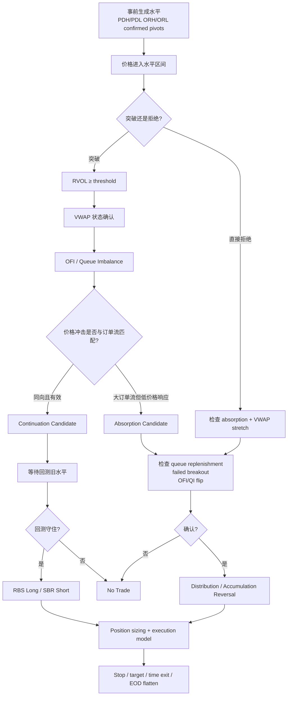
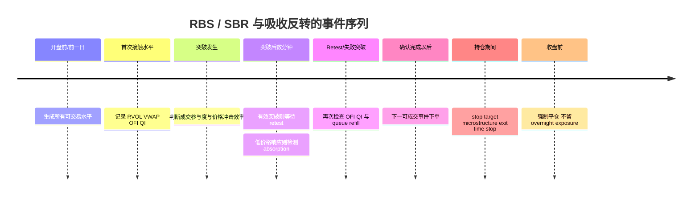

# 基于支撑/阻力、VWAP 与订单流微观结构的日内短周期量化策略：文献锚定的可复现基准

## 执行摘要

### 核心结论

严格按“**已经有学术或机构研究支持，而不是事后把 Sharpe 调高的组合**”这一标准，公开文献中**不存在一个被同行评议、跨市场、扣除真实交易成本后反复证明有效的“RBS + SBR + Volume + VWAP + Absorption Reversal + Distribution Reversal”完整策略**。尤其是“RBS/SBR”作为 *Resistance/Support Break-and-Retest*、“absorption reversal”“distribution reversal”这些交易员术语，并没有一个统一的学术定义。可以被严谨支持的是它们背后的几个独立机制。纽约联储的 Osler 研究发现，实际外汇机构发布的支撑/阻力位对一分钟级趋势中断具有显著预测力；后续研究又发现，价格穿越支撑/阻力或整数位之后，接下来约 15 分钟的价格运动比穿越随机水平更强。citeturn16search0turn27view0

微观结构部分的证据更强。Cont、Kukanov 和 Stoikov 用 50 只美国股票的 NYSE TAQ 数据发现，短时间尺度价格变化与最优买卖盘上的 **Order Flow Imbalance, OFI** 存在近似线性关系，而且价格冲击系数与市场深度负相关；他们还指出单纯成交量与价格变化的关系比 OFI 更噪、更不稳健。citeturn16search2 Gould 和 Bonart 在 10 只流动性较高的 Nasdaq 股票上发现，最优买卖盘的 **queue imbalance** 对下一次中间价移动方向具有高度显著的预测能力，尤其对 large-tick 股票更明显。citeturn16search3turn16search6 Cartea、Donnelly 和 Jaimungal 则在 11 只 Nasdaq 股票上，用 2014 年 1–6 月校准、7–12 月样本外检验，发现 LOB volume imbalance 能预测下一笔市价单方向和随后即时价格变化；把该信号加入执行模型后，样本外策略表现显著改善。citeturn17search1

VWAP 的证据性质不同：它首先是**机构执行基准和成交成本基准，而不是天然的方向性 alpha**。Berkowitz、Logue 和 Noser 的经典 Journal of Finance 论文把全日成交量加权价格用于衡量 NYSE 交易的市场冲击成本；现代最优执行理论也能在特定模型条件下得到 VWAP 型执行策略的最优性。citeturn22search18turn22search1 因此，本报告把 VWAP 用于定义日内状态、偏离度和趋势/均值回归条件，而不假设“价格低于 VWAP 就买、高于 VWAP 就卖”本身具有稳健 alpha。

同样重要的是反面证据。Neely 和 Weller 对 1996 年外汇半小时数据进行严格样本外检验后，在纳入现实交易时间和交易成本时没有发现技术规则的超额收益；该论文明确提醒，数据中可以存在稳定统计模式，却不一定能转化为可交易利润。citeturn24view0turn25view1 中国市场的结果同样值得警惕：Jin 使用 2018 年 3 月 12 日至 2021 年 3 月 10 日上海期货交易所最活跃黄金期货的 5 分钟数据，在考虑数据窥探、交易成本、市场状态和再平衡频率后，认为常规日内技术规则缺乏持续的样本外盈利能力。citeturn18search1

因此，最合适的“benchmark”不是宣称已经被证明赚钱的固定组合，而是一个**文献锚定、参数极少、机制可拆解的双状态策略**：

| 状态 | 经济机制 | 建议交易 |
|---|---|---|
| **突破有效 / efficient breakout** | 支撑阻力被穿越，成交参与度高，OFI/queue imbalance 同向，价格对订单流正常或强烈响应 | RBS 做多 / SBR 做空，即突破后等待回测确认再顺势进入 |
| **突破失败 / absorbed breakout** | 大量主动订单撞击水平位，但价格推进异常小，挂单持续补充，随后 OFI/queue imbalance 翻转 | 阻力处做空的 distribution/absorption reversal；支撑处做多的 accumulation/absorption reversal |

这种设计把 Osler 的“**水平位附近反转**”和“**水平位突破后的动量**”两个实证结果统一进一个状态机，同时利用 Cont/Gould/Cartea 的订单流变量来判断究竟是哪一种状态。citeturn16search0turn27view0turn16search2turn16search3turn17search1

对实际研究，建议把 **1 分钟作为执行/触发基准、5 分钟作为结构和状态基准**；即便最终交易的是 5 分钟 K 线，absorption、queue refill 和 OFI 最好仍从逐笔成交与逐笔盘口构造，而不是从一根 5 分钟 OHLCV K 线反推。Nasdaq Historical TotalView-ITCH 提供订单及成交事件记录；CME DataMine 的 MBO 数据可以重建每个价位的订单簿；LOBSTER 则从 Nasdaq Historical TotalView-ITCH 重建限价订单簿。citeturn20search5turn20search32turn20search3

**最重要的研究原则是：不要优化这一组合的 Sharpe。** 固定一个主参数集，仅在少量经济上可解释的邻近参数上做敏感性分析；最终使用滚动样本外检验、交易成本压力测试、White Reality Check / Hansen SPA、Deflated Sharpe Ratio 以及必要时 PBO/CSCV 来决定它是否值得上线。White 的 Reality Check 本来就是为解决反复使用同一数据进行模型选择所造成的数据窥探问题而设计；Hansen 的 SPA 对大量劣质备选模型较 Reality Check 更有检验力；DSR 则针对多重试验选择偏差和非正态收益修正 Sharpe。citeturn19search11turn19search1turn19search2turn19search3

## 文献证据与基准策略

### 证据层级

下面是与该策略最直接相关的原始研究。值得注意的是，真正较强的证据主要集中在“**水平位行为**”和“**订单流失衡**”，而不是某个固定技术指标组合。

| 文献 | 市场与样本 | 主要发现 | 对本 benchmark 的作用 |
|---|---|---|---|
| Osler, *Support for Resistance* | DEM/USD、JPY/USD、GBP/USD；六家外汇机构发布的 S/R；1996-01 至 1998-03；纽约时段一分钟报价 | 实际支撑/阻力位比随机水平更频繁地对应趋势中断；效果跨公司/货币存在差异，并可持续数个交易日 | 支持 **bounce/reversal around S/R** citeturn16search0turn16search4 |
| Osler, *Currency Orders and Exchange-Rate Dynamics* | 分钟级外汇、条件订单与整数位 | 穿越支撑/阻力/整数位后 15 分钟平均移动显著大于穿越随机位；止损订单聚集可强化趋势 | 支持 **breakout continuation** citeturn16search1turn27view0 |
| Cont, Kukanov & Stoikov | NYSE TAQ、50 只美国股票 | 短周期价格变化主要由 best bid/ask OFI 驱动；影响系数与深度负相关；成交量本身较不稳健 | OFI、depth-normalized OFI citeturn16search2 |
| Gould & Bonart | 10 只流动 Nasdaq 股票 | queue imbalance 显著预测下一次中间价方向 | 回测确认及反转确认 citeturn16search3 |
| Cartea, Donnelly & Jaimungal | 11 只 Nasdaq 股票；2014 上半年 IS、下半年 OOS | LOB volume imbalance 能预测下一笔 MO 方向和之后价格变化；加入信号后执行策略样本外收益提高 | 订单簿确认与 adverse-selection filter citeturn17search1 |
| 王春峰、孙永亮、房振明、李晔 | 中国股票高频数据 | 中国股票订单流不平衡具有显著自相关性，并对股票价格产生显著冲击 | 中文文献中的 OFI 证据 citeturn17search2 |
| Gao, Han, Li & Zhou | 美国市场日内数据 | 市场开盘最初半小时收益能够预测最后半小时收益，显示部分日内动量结构 | 独立支持“日内趋势状态”存在，但不是 RBS 的直接验证 citeturn15search0 |
| Berkowitz, Logue & Noser | NYSE 机构交易数据 | VWAP 被用于衡量执行和市场冲击成本 | 把 VWAP 当状态/执行基准，而非独立 alpha citeturn22search18turn22search2 |
| Neely & Weller | 1996 年、16,080 个半小时外汇报价 | 纳入现实交易成本和交易时间后，没有找到技术规则超额收益 | 强制使用成本后 OOS 检验 citeturn24view0turn25view1 |
| Jin | SHFE 黄金期货 5 分钟；2018-03-12 至 2021-03-10 | 数据窥探和成本调整后，技术规则没有持续有吸引力的 OOS 表现 | 中国期货反面基准 citeturn18search1 |

这张表实际上回答了“是否 proven effective”这一关键问题：**S/R 和 order-flow components 有统计证据；完整组合没有可以诚实称为“已证明”的公开证据。** 尤其 Osler 自己的结果证明的是趋势中断概率，而不是扣除点差、滑点后可实现的策略收益；Neely 和 Weller 还明确指出 Osler 的研究没有回答交易成本后的盈利问题。citeturn16search0turn25view1

因此，下述策略应称为：

> **Literature-Anchored Intraday S/R–Order-Flow Benchmark**

而不是“academic proven trading system”。

### 推荐的两模态 benchmark

定义一个事前已知的价格水平 \(L\)。市场接近 \(L\) 后只允许产生两类状态：

\[
\text{State}_t \in
\{\text{Continuation},\;
\text{Absorption/Failure},\;
\text{No Trade}\}.
\]

其中：

\[
\text{Continuation}
\Longleftrightarrow
\begin{cases}
\text{突破明确}\\
RVOL \text{ 足够}\\
OFI/QI \text{ 与突破同向}\\
\text{价格对订单流有正常/强响应}\\
VWAP \text{ 状态同向}
\end{cases}
\]

而

\[
\text{Absorption/Failure}
\Longleftrightarrow
\begin{cases}
|\text{Aggressive Flow}| \text{ 很大}\\
|\Delta Mid| \text{ 异常小或反向}\\
\text{被撞击一侧挂单持续 replenishment}\\
\text{突破重新收回}\\
OFI/QI \text{ 随后翻转}
\end{cases}
\]

这个分类有一个重要好处：**同样的“高成交量突破阻力”不再机械地被解释成做多。** 如果主动买盘很大且价格同步上涨，就是有效突破；如果主动买盘很大但价格几乎不动、卖盘不断补充，随后价格跌回阻力之下，则是“卖方吸收买盘”的失败突破。后者正是交易员通常称为 absorption/distribution 的现象；但这里采用的是基于订单流—价格冲击关系的可检验定义，而不是主观读 footprint。Cont 的研究为这种“订单流相对于价格响应”的建模提供了直接微观结构依据。citeturn16search2

## 信号的精确定义

### RBS 与 SBR：必须区分三种含义

“RBS/SBR”在交易社区中常有歧义。在这里应明确区分。

**第一种：传统支撑/阻力反转。**

阻力 \(R\)：

\[
P_t \uparrow R,\qquad
P_{t+h}<R
\]

即上涨趋势在阻力附近中断。

支撑 \(S\)：

\[
P_t \downarrow S,\qquad
P_{t+h}>S.
\]

这与 Osler 2000 的实证对象最接近：支撑/阻力是趋势可能停止或反转的水平。citeturn16search0turn26view0

**第二种：breakout continuation。**

阻力突破：

\[
C_t>R+\delta_t
\]

之后继续上涨；支撑跌破则相反。Osler 后续的微观结构研究明确检验了这一预测，并报告穿越整数水平后约 15 分钟的价格移动显著强于随机水平。citeturn27view0

**第三种：role reversal / break-and-retest。**

这是本报告建议用作 RBS/SBR 的可交易定义：

- **RBS = Resistance Becomes Support**：突破旧阻力以后，从上方回测旧阻力，水平守住，再做多。
- **SBR = Support Becomes Resistance**：跌破旧支撑以后，从下方回测旧支撑，水平压制价格，再做空。

需要非常明确地说：**公开学术文献对“突破”和“水平位反转”有证据，但并没有把“break → retest → old resistance becomes support”这一完整形态以 RBS/SBR 名称证明为通用 alpha。** 所以 retest 应视为一种减少假突破、改善执行价和定义止损位置的结构性过滤器，而不是一个已经独立被学术验证的 anomaly。Osler 的两类实证结果分别支持反弹和突破这两个组成部分。citeturn16search0turn27view0

### 支撑阻力必须事前生成

为避免 hindsight charting，benchmark 不应让研究者人工画线。建议只使用明确的、当时已经可以知道的水平：

\[
\mathcal L_d =
\{
PDH_d,\;PDL_d,\;
ORH_d,\;ORL_d,\;
ConfirmedPivot,\;
RoundNumber
\}.
\]

其中：

**前日高低点**

\[
PDH_d=\max P_{d-1},\qquad
PDL_d=\min P_{d-1}.
\]

**Opening Range**

例如开盘前 30 分钟：

\[
ORH_d=\max_{t\in[09{:}30,10{:}00]}H_t,
\qquad
ORL_d=\min_{t\in[09{:}30,10{:}00]}L_t.
\]

只有到 10:00 后才允许使用该水平。

**Confirmed Pivot**

若候选 pivot 需要左右各 \(m\) 根 K 线：

\[
H_k=\max(H_{k-m},...,H_{k+m}),
\]

那么直到 \(k+m\) 时刻才可以把 \(H_k\) 标记为阻力，否则存在直接的 look-ahead bias。

**整数位**

在外汇方面，Osler 发现实际机构支撑阻力明显集中于整数/半整数位置，且后续研究将这种聚集与止损、止盈条件订单联系起来。citeturn16search4turn16search1 对股票/股指期货，是否存在同样强度的整数位效应必须重新估计，而不应直接移植外汇结果。

为了避免“碰到一分钱也算突破”，定义水平区间：

\[
Z(L,t)=
[L-\delta_t,L+\delta_t],
\]

基准：

\[
\delta_t=
\max
\left(
1\text{ tick},
0.15\,ATR_{20,t}
\right).
\]

这里的 \(0.15\) 是**研究初始值，不是文献估计出的最优数值**；稳健性测试使用 \(0.10,0.15,0.20\) ATR，而不是连续搜索最佳值。

### RBS 做多的正式状态机

首先突破：

\[
B_t^+(R)=
\mathbf{1}
\left[
C_t>R+\delta_t
\right].
\]

并要求：

\[
RVOL_t\ge1.5,
\]

\[
z(OFI_t)\ge1,
\]

\[
M_t>VWAP_t,
\]

其中 \(M_t\) 为中间价。

在随后 \(H\) 个 bar 中必须有一次回测：

\[
\exists j\in[t+1,t+H]:
L_j\le R+\delta_j,
\]

但回测确认时：

\[
C_j>R,
\]

并且微观结构没有明显转为空头：

\[
QI_j>-q_0,\qquad OFI_j\gtrsim0.
\]

然后在**确认完成后的下一可交易事件**买入，而不是假定能够以确认 K 线收盘价成交。

推荐研究默认值：

| 参数 | 1 分钟 | 5 分钟 | 敏感性范围 |
|---|---:|---:|---:|
| 水平区间 | 0.15 ATR | 0.15 ATR | 0.10 / 0.15 / 0.20 |
| RVOL breakout | 1.5 | 1.5 | 1.2 / 1.5 / 2.0 |
| OFI z-score | 1.0 | 1.0 | 0.5 / 1.0 / 1.5 |
| Retest horizon | 3–10 bars | 1–3 bars | 按实际分钟数匹配 |
| 初始 stop | 0.75 ATR | 0.75 ATR | 0.5 / 0.75 / 1.0 |
| 最大持有 | 15–30 min | 30–60 min | 预先离散设定 |

这些数字是为了建立**少参数 benchmark**的研究默认值，不应被解释成文献中的“最优参数”。

SBR 做空完全镜像：

\[
C_t<S-\delta_t,\quad
RVOL_t\ge1.5,\quad
z(OFI_t)\le-1,\quad
M_t<VWAP_t,
\]

之后从下方回测旧支撑：

\[
H_j\ge S-\delta_j,\qquad C_j<S.
\]

### 成交量：使用 time-of-day relative volume，而非绝对量

Cont 等人的结果意味着，不应该把总成交量本身当作主要微观结构预测变量，因为 OFI 与价格之间的关系更直接、也更稳健。citeturn16search2 因此 volume 的角色应当只是“市场参与度确认”。

对于交易日 \(d\) 的第 \(k\) 个分钟槽：

\[
RVOL_{d,k}=
\frac
{V_{d,k}}
{\operatorname{Median}
(V_{d-1,k},...,V_{d-D,k})}.
\]

推荐 \(D=20\) 个历史交易日。

这比：

\[
V_t/\text{rolling mean}(V)
\]

更适合日内研究，因为它把 09:31 与历史 09:31 比，而不是把开盘成交量和午间成交量混在一起。

推荐状态：

\[
RVOL<0.8:
\text{低参与度}
\]

\[
0.8\le RVOL<1.5:
\text{正常}
\]

\[
RVOL\ge1.5:
\text{breakout confirmation}.
\]

进一步可以要求：

\[
V_{\text{retest}}<
V_{\text{breakout}},
\]

然后确认 bar 再出现成交量回升。这是待检验的结构条件，不应事后寻找最优比例。

### VWAP：状态变量，而不是机械反转信号

交易级 session VWAP：

\[
VWAP_t=
\frac{\sum_{i\le t}p_i q_i}
{\sum_{i\le t}q_i}.
\]

Berkowitz、Logue 和 Noser 将 volume-weighted average transaction price 用作交易成本和市场冲击的执行基准；VWAP 后来成为最优执行研究中的核心 benchmark。citeturn22search18turn22search1

本策略使用：

\[
d_t=M_t-VWAP_t
\]

以及标准化偏离：

\[
z^{VWAP}_t=
\frac{M_t-VWAP_t}
{\sigma^{VWAP}_{d,k}},
\]

其中分母最好使用过去 \(D\) 个交易日在相同日内时间附近的 VWAP 残差尺度，而不是使用当天未来数据。

**趋势模式：**

\[
M_t>VWAP_t,\qquad
\frac{\Delta VWAP}{\Delta t}>0
\]

支持 long RBS；

\[
M_t<VWAP_t,\qquad
\frac{\Delta VWAP}{\Delta t}<0
\]

支持 short SBR。

**反转模式：**

只有在明显 absorption/failed breakout 同时发生时，才允许：

\[
|z^{VWAP}|>z_0
\]

成为辅助条件。

也就是说，不能把：

> “高于 VWAP = short，低于 VWAP = long”

作为 benchmark。这会把 execution benchmark 错当成已经被证明的均值回归 alpha。

### OFI：核心微观结构变量

按照 Cont、Kukanov 和 Stoikov 的 best-level OFI 思路，对于第 \(n\) 个盘口更新：

\[
e_n=
\mathbf 1_{P^b_n\ge P^b_{n-1}}q^b_n
-
\mathbf 1_{P^b_n\le P^b_{n-1}}q^b_{n-1}
\]

\[
-
\mathbf 1_{P^a_n\le P^a_{n-1}}q^a_n
+
\mathbf 1_{P^a_n\ge P^a_{n-1}}q^a_{n-1}.
\]

时间窗口 \(\Delta\) 上：

\[
OFI_\Delta=\sum_{n\in\Delta}e_n.
\]

Cont 等人发现：

\[
\Delta P_\Delta
\approx
\beta\,OFI_\Delta+\epsilon,
\]

并且 \(\beta\) 与市场深度负相关。citeturn16search2

因此跨股票比较时，更稳妥的变量是：

\[
X^{OFI}_t=
\frac{OFI_t}{Depth_t}
\]

或者对每只证券分别计算 rolling z-score，而不要直接把 ES 的 OFI 数值和 AAPL 的 OFI 数值比较。

### Queue imbalance

定义：

\[
QI_t=
\frac
{Q^b_t-Q^a_t}
{Q^b_t+Q^a_t}.
\]

其值域：

\[
QI_t\in[-1,1].
\]

正值说明 best bid 队列相对较大，负值说明 best ask 较大。Gould 和 Bonart 对 10 只 Nasdaq 股票的研究显示，该变量对下一次 mid-price move 的方向具有显著预测能力；对于 large-tick 股票，分类提升尤其明显。citeturn16search3

本 benchmark 不应把某个 \(QI=0.23\) 当成永恒阈值，而应该：

\[
z(QI_t)
\]

或者按资产独立使用经验分位数，例如上 70% / 下 30%。

### 主动买卖量与 trade delta

如果交易数据本身没有 aggressor flag，可以用报价测试识别主动方向：

\[
s_i=
\begin{cases}
+1,&p_i>mid_i\\
-1,&p_i<mid_i
\end{cases}
\]

midpoint 成交再用 tick test 处理。这与 Lee–Ready 类型的 trade-signing 方法一致；相关研究通常把高于 bid–ask midpoint 的成交归为买方主动、低于 midpoint 的成交归为卖方主动。citeturn22search3turn22search25

于是：

\[
\Delta V_t=
\sum_{i\in t}s_iq_i.
\]

注意：

\[
\Delta V_t\neq OFI_t.
\]

前者主要描述**实际执行的主动成交**；OFI 还把限价单新增和撤单等最佳盘口变化纳入供需变化。Cont 的结果正是说明单纯 trade volume 不足以完整描述短周期价格压力。citeturn16search2

### Absorption reversal：用“订单流很大、价格响应很小”定义

“Absorption reversal”不是 Cont 等论文里的标准命名，所以不应假装存在一个公认公式。最可辩护的学术映射是：

> **大量方向性订单流出现，但实际价格响应显著弱于根据历史 OFI–price-impact 关系应有的响应，同时被攻击的一侧队列不断补充。**

首先用过去数据估计：

\[
\Delta M_t=
\beta X^{OFI}_t+\epsilon_t.
\]

必须只用 \(t-1\) 以前的数据估计 \(\beta\)。

定义 impact residual：

\[
u_t=
\Delta M_t-
\hat\beta_{t-1}X^{OFI}_t.
\]

阻力附近的**卖方 absorption**：

\[
z(\Delta V_t)\ge2
\]

说明大量主动买盘；

同时：

\[
z(X^{OFI}_t)\ge1
\]

但：

\[
z(u_t)\le-1.5,
\]

即实际上涨幅度远小于订单流模型预期。

如果有 MBO/L3 数据，再计算 ask replenishment：

\[
Refill^{ask}_t=
\frac
{\text{新增到阻力附近 ask 的数量}}
{\text{在该区域被主动买单成交的数量}+\varepsilon}.
\]

研究默认触发：

\[
Refill^{ask}\ge0.5.
\]

最后必须出现价格失败：

\[
H_t>R
\]

但：

\[
C_t<R
\]

以及：

\[
QI_{t+h}<0
\quad \text{或}\quad
OFI_{t+h}<0.
\]

此时才产生 short reversal。

这里的 \(2\sigma,1.5\sigma,0.5\) 是**预注册 benchmark 参数**，而非论文估计值；真正的学术依据是 OFI、深度、price impact 和 queue imbalance 的关系。citeturn16search2turn16search3turn17search1

支撑附近 bullish absorption 完全镜像：

\[
z(\Delta V)\le-2
\]

但价格下跌异常有限，bid 挂单不断补充，随后价格重新收回支撑：

\[
L_t<S,\qquad C_t>S,
\]

且 \(QI/OFI\) 翻正，产生 long reversal。

### Distribution reversal 的严格定义

“Distribution reversal”比 absorption 更缺乏统一的学术微观结构定义。因此建议**不要把它当成另一个独立指标**，而是定义成：

> **阻力区域的 bearish absorption + failed breakout。**

也就是：

\[
\text{DistributionReversal}
=
\text{High Aggressive Buy Flow}
\]

\[
+\text{Low Price Progress}
+\text{Ask Replenishment}
+\text{Failed Breakout}
+\text{OFI/QI Flip}.
\]

其经济解释是：主动买方不断拿走 ask，但被动卖方持续补货，使价格无法有效上行；当主动买单衰竭时，价格反向。这种解释与 order-flow/price-impact 文献一致，但“distribution reversal”这一名称本身不是这些论文中的标准因子。citeturn16search2turn17search1

如果希望术语对称，可以把支撑处的镜像定义为：

\[
\text{AccumulationReversal}.
\]

这比额外创造两个不同的技术指标更干净。

## 数据、标的与研究架构

### 首选标的

从研究可复现性看，排序建议是：

| 标的 | 推荐度 | 原因 | 主要问题 |
|---|---|---|---|
| **ES / NQ 等流动股指期货** | 最高 | 中央限价订单簿、统一 tick、深度数据容易解释；CME 提供 MBO 等历史数据 | 换月、夜盘、宏观事件、容量 |
| **SPY / QQQ 等 ETF** | 很高 | 极高流动性，VWAP 和日内结构清楚，便于与期货对照 | 美国股票市场多交易场所，LOB 信号需要 venue-aware |
| **AAPL/MSFT/NVDA 等大型股** | 很高 | TAQ/ITCH 数据丰富，已有 Nasdaq LOB 文献基础 | 碎片化、公司事件、点差/short constraints |
| **CME FX futures** | 高 | 相比 OTC spot 更适合重建统一订单簿 | 与银行间 spot microstructure 不完全相同 |
| **OTC FX** | 中等 | Osler 的 S/R 文献最直接 | 市场分散，单一 venue order book 不代表全市场 |
| **SHFE 黄金/原油等期货** | 研究价值高 | 已有中文/中国市场 5m 技术规则研究 | 市场制度和交易成本需独立建模 |
| **其他 ETFs** | 高 | 易于组合资产验证 | 流动性差异较大 |

CME DataMine 明确提供包括 Market by Order、market depth 和 PCAP 在内的历史期货数据，MBO 可以提供重建订单簿所需的订单消息。citeturn20search2turn20search32 美国股票方面，NYSE Daily TAQ 包括跨 NYSE、Nasdaq 和区域交易所的成交、报价及 NBBO；Nasdaq Historical TotalView-ITCH 则提供 Nasdaq 系统中的逐笔可显示订单和交易记录。citeturn20search4turn20search9

### 最低数据要求

**只做价格/成交量 benchmark：**

- OHLCV 1m/5m；
- bid/ask 或至少有效 spread proxy；
- 日内交易时段；
- corporate-action/reference data。

这足够做：

- S/R；
- RBS/SBR；
- RVOL；
- VWAP。

但**不够真正检测 absorption**。

**完整 microstructure benchmark：**

- tick-by-tick trades；
- tick-by-tick quotes；
- bid/ask sizes；
- aggressor side，或可重建 trade sign；
- L2/MBO order book；
- order add/cancel/modify/execute；
- volume by price；
- exchange/venue identifier；
- 毫秒/纳秒 timestamp。

Nasdaq TotalView-ITCH 的历史产品包含逐笔订单和交易信息；LOBSTER 从该事件流按需重建订单簿，并提供 message 与 orderbook 文件。citeturn20search5turn20search3turn20search7 CME MBO 则包含重建每个价位订单状态所需的数据。citeturn20search32

### 数据源

| 来源 | 类型 | 适用市场 | 粒度/用途 |
|---|---|---|---|
| NYSE Daily TAQ | 官方商业数据 | 美国股票/ETF | 全市场 trades、quotes、NBBO；NYSE 称历史数据可追溯至 1993 年 citeturn20search27 |
| Nasdaq Historical TotalView-ITCH | 官方 | Nasdaq 股票 | tick-by-tick displayable orders、trades、imbalance citeturn20search9turn20search25 |
| CME DataMine | 官方 | futures/options | MBO、depth、PCAP 等 citeturn20search2turn20search32 |
| LOBSTER | 学术/商业数据处理 | Nasdaq | 从 Historical TotalView-ITCH 重建 LOB；有样例数据 citeturn20search3turn20search7 |
| Databento | 商业 | equities/futures | MBO/L3、trades、quotes、depth、OHLCV；MBO 包括 add/cancel/modify/fills citeturn21search16turn21search12 |
| AlgoSeek | 商业 | 美股/CME futures | equities TAQ；CME futures 最高十档 depth，分钟数据等 citeturn21search1turn21search13 |
| Tick Data | 商业 | equities/futures/FX | 美股 Level-I tick、NBBO、trades；美股历史覆盖至 1993 年，NBBO 和一分钟 quote bars 至 2004 年 citeturn21search10 |
| Massive | 商业/API | 美国股票 | historical trades、NBBO quotes、minute aggregates citeturn21search15turn21search23 |
| Nasdaq / LOBSTER sample | 公共样例 | Nasdaq | 可验证 parser、LOB reconstruction 和 OFI，不足以做严肃长期显著性研究 citeturn20search7 |

### 推荐研究样本

如果研究美国市场，较合理的主实验不是“所有东西混在一起”，而是两个平行 panel：

**期货 panel**

\[
\{ES,NQ\}
\]

必要时加：

\[
\{CL,GC,ZB\}
\]

用于跨资产 robustness。

**股票/ETF panel**

\[
\{SPY,QQQ\}
+
10\sim30 \text{ point-in-time large-cap equities}.
\]

股票名单必须按当时的指数成分或事前流动性筛选生成，而不能今天挑出仍然存活的赢家再回测，否则存在 survivorship bias。

为了让 regime coverage 足够充分，正式研究最好包含数年而不是几个月；但不要把时间跨度本身当作统计独立样本量，因为一分钟数据的相邻观察高度依赖。策略显著性最好以“**交易日**”或更长 block 为 resampling 单位，而不是假设每个一分钟 bar 都是独立 observation。

### 文献中的实际频率和日期

Osler 的主要 S/R 研究使用 1996 年 1 月至 1998 年 3 月、纽约 09:00–16:00 的一分钟外汇报价，因此与本项目的 1m 目标高度一致。citeturn16search4

Neely/Weller 使用 1996 年全年的 16,080 个半小时 bid/ask 平均报价，对 DEM、JPY、CHF、GBP 进行日内技术规则检验，结论主要用来提醒成本和 OOS 问题，而不是作为本策略的精确频率 benchmark。citeturn25view1

Cartea 等人的订单簿研究使用 11 只 Nasdaq 股票，以 2014 年 1–6 月为 in-sample、7–12 月为 out-of-sample，这是很有价值的真正 OOS 微观结构设计范例。citeturn17search1

Jin 的中国黄金研究则直接使用 5 分钟最活跃 SHFE 黄金期货，时间为 2018 年 3 月 12 日至 2021 年 3 月 10 日；其负面结果正好适合作为本项目 5m benchmark 的“零假设提醒”。citeturn18search1

## 交易规则、执行与风险控制

### 信号流水线



核心思想是**先决定市场对订单流的响应类型，再决定顺势还是反转**。这与文献所支持的两个事实相容：水平位既可能引发趋势中断，也可能在真正被突破以后产生加速；订单流失衡和 queue imbalance 提供了区分这两种状态的微观结构信息。citeturn16search0turn27view0turn16search2turn16search3

### 事件时间线



### Continuation sleeve 的具体规则

**Long RBS：**

进入候选：

\[
C_t>R+\delta_t
\]

且：

\[
RVOL_t\ge1.5,
\quad
z(OFI_t)\ge1,
\quad
M_t>VWAP_t.
\]

若有 LOB：

\[
QI_t>0
\]

或至少不显著为负。

然后在限定时间内回测：

\[
P_j\in Z(R,j)
\]

但最终：

\[
C_j>R.
\]

入场：

\[
Entry=\text{first executable price after confirmation}.
\]

**Short SBR** 完全镜像。

一个重要细节是：如果 breakout bar 自己的 OFI 很强，但回测时 OFI 极度反向，则放弃交易；这样不把每次回测都机械解释成“旧阻力变支撑”。

### Absorption/distribution sleeve

阻力处：

1. 价格进入或短暂突破 \(R\)；
2. buy delta / OFI 明显正；
3. 根据历史 impact model，本来应该上行得更多；
4. 实际价格却基本不进展；
5. ask queue 有补充；
6. close 回到 \(R\) 以下；
7. OFI/QI 转负。

形式化：

\[
z(\Delta V)\ge2
\]

\[
z(OFI/Depth)\ge1
\]

\[
z(u)\le-1.5
\]

\[
Refill^{ask}\ge0.5
\]

\[
C<R
\]

以及：

\[
QI_{t+h}<0.
\]

才 short。

这比“看到大红色成交量但是价格没涨，所以卖”严格得多，因为它定义了：

- 大到什么程度；
- 价格没涨是相对于什么基准；
- 哪一侧被动流动性在补充；
- 最后怎样确认方向翻转。

支撑做多则镜像。

### 止损

Continuation trade 的结构性失效点最自然：

RBS long：

\[
Stop=
R-\max(1\,tick,\lambda ATR)
\]

或者：

\[
Entry-0.75ATR.
\]

两者取更保守的设置，并固定规则。

SBR short 镜像。

Absorption reversal 的 stop 应放在失败突破极值之外：

\[
Stop_{\text{short}}=
H_{\text{failure}}
+\max(1\,tick,0.1ATR).
\]

因为如果市场重新突破 absorption extreme，最初的“被动卖方成功吸收”假设已经失效。

### 止盈与退出

为了避免用 profit target 过拟合，可以把 benchmark 分成两个固定版本。

**结构退出版：**

退出条件：

\[
OFI/QI \text{ 明显反向}
\]

或到下一个事前已知 S/R；

或 VWAP state 被破坏；

或到达最大持仓时间。

**固定 R-multiple 版：**

\[
SL=1R,\qquad TP=1.5R.
\]

两者均必须作为**预注册 variant**，不能先跑一百种 TP/SL 再报告最好的。

所有持仓在交易时段结束前清空，从而真正保持 intraday benchmark。

### Position sizing

风险预算：

\[
B_t=rNAV_t.
\]

建议研究初始值：

\[
r=5\sim10\text{ bp NAV/trade}.
\]

不是因为这个值学术上“最优”，而是为了让不同资产的结果以相似风险单位比较。

若 stop 距离为 \(d_t\)：

\[
Q_t=
\left\lfloor
\frac
{B_t}
{d_t\times PointValue}
\right\rfloor.
\]

然后进一步约束：

\[
Q_t\le Q^{participation},
\]

\[
Q_t\le Q^{gross},
\]

\[
Q_t\le Q^{liquidity}.
\]

研究中应至少测试本地一分钟成交量的：

\[
0.25\%,\;0.5\%,\;1\%,\;2\%
\]

participation caps。目的不是寻找最佳比例，而是观察策略是否只有在不现实的市场容量下才能盈利。

### 每日风险限制

建议固定：

\[
DailyLossLimit=30\sim50bp NAV
\]

作为研究级 kill switch；

同一资产不加仓超过一个方向；

同一高度相关股指资产控制总 beta / notional；

连续多次 stop 后不要添加“神奇暂停规则”，除非该规则事前定义。

这些都是风险治理默认值，不是 alpha 参数，因此应与预测信号参数分离。

### 真实交易成本模型

最基本模型：

\[
Cost=
Spread+
Fees+
Slippage+
MarketImpact.
\]

对于 market order，从 mid 计算单边执行成本：

\[
C_{\text{spread}}
=
\frac{Ask-Bid}{2}.
\]

完整 round trip 若两边都 crossing，单是 spread 就约为一整个 contemporaneous bid–ask spread，在此基础上再加入手续费、滑点和影响成本。

对于真实 LOB replay：

**Market order**

沿相反方向订单簿逐档吃单：

\[
P_{\text{fill}}
=
\frac{\sum_jP_jq_j}
{\sum_jq_j}.
\]

**Limit order**

必须进入真实或保守模拟的 queue：

\[
QueueAhead_t
\]

只有前方排队量已经被成交/撤掉后才允许 fill。

如果只使用 bar 数据，绝不能写成：

> signal 在 10:31 的收盘价确认，因此 10:31 收盘价成交。

正确的是：

\[
Signal_t
\rightarrow
Fill_{t+1}
\]

至少使用下一 bar open，再加 spread/slippage。

同样，如果一根 5 分钟 K 线内既碰 stop 又碰 target，OHLCV 无法知道先后顺序；必须使用更低频数据还原路径，或者保守地假定不利事件先发生。

### 滑点压力测试

不要只报告一个成本假设。推荐：

| 情景 | 额外 residual slippage |
|---|---:|
| Ideal diagnostic | 0 tick |
| Base | 0.25 tick/side |
| Conservative | 0.5 tick/side |
| Severe | 1.0 tick/side |

每种场景都必须**另外**包含实际 spread 与费用。

如果策略只有 0 tick 假设下盈利，而 0.25–0.5 tick 就失效，应判定为缺乏可交易性，而不是报告 gross Sharpe。

### Latency

对纯 1m/5m close-to-next-bar 策略，几十毫秒的延迟通常不是主要模型误差；但一旦 absorption 判断依赖逐笔 queue refill 和 OFI flip，就已经进入 event-time microstructure，延迟可能改变成交价格甚至信号本身。

因此建议把执行延迟作为压力变量：

\[
L\in\{0,\;50ms,\;250ms,\;1s\}.
\]

流程必须是：

\[
SignalTime
\rightarrow
SignalTime+L
\rightarrow
\text{observe executable book}
\rightarrow
Fill.
\]

不能先看到未来盘口再把 latency 从时间戳上减掉。

MBO 数据能够表示单个订单事件和 queue position，因此比分钟 OHLCV 更适合这种模拟。citeturn21search0turn21search16

## 回测、统计检验与稳健性

### 推荐的研究顺序

最容易犯的错误是：

1. 在全部数据上计算信号；
2. 扫几千组参数；
3. 找 Sharpe 最大值；
4. 再称其为 benchmark。

White 早已指出，反复使用同一历史样本选择模型，会导致原本由偶然性产生的“最好结果”看起来具有统计意义；Reality Check 正是为检验“搜索出来的最佳模型是否真正优于 benchmark”而提出。citeturn19search0turn19search11

更合适的是**先预注册经济机制和少量参数，然后滚动 OOS**。

### Walk-forward

如果有至少数年数据，推荐：

\[
12m\ Training
\rightarrow
3m\ Validation
\rightarrow
3m\ OOS
\]

每三个月向前滚动。

Training 只允许做：

- 历史同时间段 RVOL normalization；
- OFI impact coefficient；
- volatility scaling；
- 基本 liquidity thresholds。

Validation 只允许在很小的离散参数集中选 preset。

OOS 完全冻结。

如果数据较短，可以使用：

\[
6m\ calibration
\rightarrow
1m\ OOS
\]

滚动进行。

不能在看到 OOS 后改变阈值，再继续把同一段称为 OOS。

### Purging 与 embargo

RBS 可能先产生 breakout candidate，然后在未来 \(H\) 分钟才能知道是否 retest；交易又可能继续持有 \(T\) 分钟。

因此训练/验证边界要至少 purge：

\[
H+T
\]

的重叠观察，否则一个样本的标签可能穿越 fold boundary。

对于日内 sequential strategy，**walk-forward 应是主检验**；purged CV 更适合补充估计参数稳定性，而不是替代时间顺序 OOS。

### 核心指标

不要直接把一分钟策略收益平均值/标准差乘：

\[
\sqrt{252\times390}
\]

作为主要 Sharpe，因为分钟收益通常存在时间相关和持仓重叠。

建议先构造每日策略收益：

\[
r_d=
\frac{PnL_d}{NAV_{d-1}}.
\]

然后：

\[
Sharpe=
\sqrt{252}
\frac{\bar r_d-r_f/252}
{s(r_d)}.
\]

同时报告：

\[
CAGR=
\left(
\frac{NAV_T}{NAV_0}
\right)^{1/Y}-1,
\]

\[
MaxDD=
\min_t
\left(
\frac{NAV_t}
{\max_{s\le t}NAV_s}
-1
\right).
\]

Hit rate：

\[
HR=
\frac{N_{win}}{N_{trades}}.
\]

Expectancy：

\[
E=
p\bar W-(1-p)|\bar L|.
\]

另外必须报告：

- gross PnL；
- net PnL；
- Sharpe；
- Sortino；
- CAGR；
- max drawdown；
- Calmar；
- hit rate；
- average win / loss；
- expectancy；
- profit factor；
- average holding time；
- trades/day；
- turnover；
- average spread paid；
- slippage；
- capacity / participation；
- long/short contribution；
- continuation/reversal contribution。

单独报告 hit rate 很容易误导，因为 35% 胜率、平均盈利 3R 的系统可以很好；70% 胜率、平均亏损巨大也可以很差。

### 统计显著性

**Block bootstrap**

按交易日或数日 block 对 daily PnL 进行 bootstrap，估计：

\[
CI(\bar r),\quad CI(Sharpe),\quad CI(MaxDD).
\]

不要把数百万个 LOB messages 当成数百万个独立观察。

**White Reality Check**

若测试：

\[
M
\]

组 RBS/VWAP/OFI 参数，检验的是：

\[
H_0:
\max_{m\le M}
E[f_m-f_{benchmark}]
\le0.
\]

它专门控制因 repeated model search 产生的数据窥探问题。citeturn19search0turn19search11

**Hansen SPA**

Hansen 的 Superior Predictive Ability test 是对 Reality Check 的改进，其 studentized statistic 和样本依赖 null distribution 使其对很多明显较差/无关模型不那么敏感。citeturn19search1turn19search5

因此，本项目如果确实测试多个参数配置，SPA 比“每个策略各做一个普通 t-test”更合适。

**Deflated Sharpe Ratio**

若报告最终最大 Sharpe，应同时报告 DSR。DSR 的设计目的正是纠正：

- multiple testing / selection bias；
- 非正态收益造成的 Sharpe 膨胀。

citeturn19search2turn19search17

**Probability of Backtest Overfitting**

如果参数试验数量较多，可以用 CSCV/PBO 检测一个 in-sample winner 在 OOS 中排名恶化的概率；该方法就是针对投资回测中过拟合概率提出的。citeturn19search3turn19search22

### 敏感性矩阵

而不是搜索上千组组合，建议只做小型预注册网格：

| 参数 | Low | Baseline | High |
|---|---:|---:|---:|
| S/R zone / ATR | 0.10 | 0.15 | 0.20 |
| RVOL breakout | 1.2 | 1.5 | 2.0 |
| OFI z | 0.5 | 1.0 | 1.5 |
| Absorption flow z | 1.5 | 2.0 | 2.5 |
| Impact-residual z | 1.0 | 1.5 | 2.0 |
| Refill ratio | 0.25 | 0.50 | 1.00 |
| stop / ATR | 0.50 | 0.75 | 1.00 |
| extra slippage / side | 0.25 tick | 0.50 tick | 1.00 tick |

正确的结论不是：

> 最佳组合 = 0.143 ATR、RVOL 1.63、OFI 1.17。

而应是：

> 在 \(0.10\!-\!0.20\) ATR、RVOL \(1.2\!-\!2.0\)、OFI \(0.5\!-\!1.5\sigma\) 内形成一个宽的正收益 plateau。

如果只有一个非常狭窄参数点赚钱，它应被视为过拟合警报。

### Ablation test

这是确认“组合中的哪一部分真正贡献 alpha”最重要的测试之一。

依次跑：

\[
M_0=S/R
\]

\[
M_1=M_0+RVOL
\]

\[
M_2=M_1+VWAP
\]

\[
M_3=M_2+OFI/QI
\]

\[
M_4=M_3+Absorption.
\]

然后比较：

\[
\Delta Sharpe,\quad
\Delta NetPnL,\quad
\Delta Turnover,\quad
\Delta Drawdown.
\]

预期上，文献最值得信任的增量应该来自 OFI/QI，而不是不断增加传统 technical filters，因为 Cont、Gould、Cartea 分别对订单流和盘口失衡给出了直接微观结构证据。citeturn16search2turn16search3turn17search1

### Placebo tests

S/R 策略非常适合做 placebo：

**水平位平移：**

\[
L'=
L+k\cdot tick
\]

随机把水平位移动若干 tick。

**随机时间位：**

保持每日日内时间分布相同，但随机分配水平。

**随机方向：**

保持 entry times 不变，随机翻转方向。

**matched-entry placebo：**

在与实际 entry 相同的 volatility、spread 和 time-of-day 环境随机入场。

如果真正的 S/R 水平并不显著优于 placebo，策略很可能只是在捕捉通用日内 momentum，而不是结构水平本身。

这种思想与 Osler 将真实 S/R 和大量随机生成水平进行比较的设计非常接近；她的研究正是通过这种 bootstrap/random-level 思路确认实际支撑阻力不只是任意水平。citeturn16search4

### Regime dependence

至少拆成：

\[
Volatility:
Low/Medium/High
\]

\[
Liquidity:
Spread/Depth\ quartiles
\]

\[
Time:
Open/Midday/Close
\]

\[
Trend:
VWAP\ slope + realized trend
\]

\[
Asset:
Futures/ETF/Single\ Stocks.
\]

特别应检查策略是否：

- 几乎所有利润都来自开盘 30 分钟；
- 只在高波动 regime 盈利；
- 只在一只股票上赚钱；
- short side 完全失败；
- absorption sleeve 只有特定年份有效。

如果 80% 的最终利润由一个很短 regime 贡献，应该单独报告，而不是只给全样本 Sharpe。

### Survivorship 与 look-ahead 检查

美国股票必须使用 point-in-time universe，并保留退市证券。

所有 corporate actions 必须在正确时间处理。

opening range 到形成完成前不能使用。

pivot 必须等右侧确认 bar 完成。

VWAP 只能累计到当前时刻：

\[
VWAP_t=
\frac{\sum_{i\le t}p_iv_i}
{\sum_{i\le t}v_i},
\]

不能使用最终全日 VWAP 做实时信号。

RVOL 的基准必须来自过去交易日，不允许把当天后续成交量加入 denominator。

期货如果用连续合约做 signal，应在实际可交易合约上计算成交价格和成本；roll selection 必须基于当时已经可知的 volume/open-interest 信息，而不是事后寻找“最流动合约”。

### 最低“通过”标准

不建议把“Sharpe > 2”之类单一值作为证明。更可靠的研究 gate 是同时满足：

1. **严格 OOS net PnL 为正**，而不仅 gross PnL；
2. bootstrap/SPA 等显著性检验不能拒绝不了策略优势；
3. 大多数 walk-forward folds 而非单个时期盈利；
4. 多个流动标的方向一致；
5. baseline 附近存在参数 plateau；
6. 0.5–1 tick 额外滑点压力下不立即崩溃；
7. 结果不依赖 survivorship/look-ahead；
8. continuation 和 reversal 两个 sleeve 可以分别解释；
9. 真实水平显著优于 time-of-day matched placebo；
10. 最佳配置经过 DSR/多重检验修正后仍有统计说服力。

White、Hansen 及 DSR/PBO 文献共同说明，单纯把最大历史 Sharpe 当成证据是不充分的。citeturn19search0turn19search1turn19search2turn19search3

## 可复现实现与研究输出

### Python：VWAP、RVOL 与 ATR

下面代码是用于实现上述 benchmark 的研究模板，不包含任何拟合出来的“最佳参数”。

```python
from __future__ import annotations

import numpy as np
import pandas as pd


def add_bar_features(
    bars: pd.DataFrame,
    rvol_days: int = 20,
    atr_window: int = 20,
) -> pd.DataFrame:
    """
    Required columns:
        timestamp, open, high, low, close, volume

    Assumptions:
        - timestamp is timezone-aware and sorted.
        - One instrument at a time.
        - Regular trading session has already been selected.
    """
    x = bars.copy().sort_values("timestamp")
    x["timestamp"] = pd.to_datetime(x["timestamp"])

    x["session"] = x["timestamp"].dt.date
    x["slot"] = (
        x["timestamp"].dt.hour * 60
        + x["timestamp"].dt.minute
    )

    # True trade-level VWAP is preferable.
    # Typical price is only an approximation when we have OHLCV bars.
    x["typical_price"] = (
        x["high"] + x["low"] + x["close"]
    ) / 3.0

    x["pv"] = x["typical_price"] * x["volume"]

    x["cum_pv"] = x.groupby("session")["pv"].cumsum()
    x["cum_volume"] = x.groupby("session")["volume"].cumsum()

    x["vwap"] = x["cum_pv"] / x["cum_volume"].replace(0, np.nan)

    # Causal time-of-day relative volume.
    # Within each minute slot, only earlier sessions are used.
    def historical_median(s: pd.Series) -> pd.Series:
        return s.shift(1).rolling(
            rvol_days,
            min_periods=max(5, rvol_days // 2)
        ).median()

    x["expected_volume"] = (
        x.groupby("slot", group_keys=False)["volume"]
        .apply(historical_median)
    )

    x["rvol"] = (
        x["volume"]
        / x["expected_volume"].replace(0, np.nan)
    )

    # Causal ATR.
    prev_close = x["close"].shift(1)

    tr = pd.concat(
        [
            x["high"] - x["low"],
            (x["high"] - prev_close).abs(),
            (x["low"] - prev_close).abs(),
        ],
        axis=1,
    ).max(axis=1)

    x["atr"] = tr.rolling(
        atr_window,
        min_periods=atr_window
    ).mean()

    x["vwap_dev_atr"] = (
        (x["close"] - x["vwap"])
        / x["atr"].replace(0, np.nan)
    )

    return x
```

有真实逐笔成交时，应直接：

```python
vwap = (trade_price * trade_size).cumsum() / trade_size.cumsum()
```

而不要用 typical-price approximation；VWAP 本质上是成交量加权的实际成交价格基准。citeturn22search18turn22search1

### Python：Cont-style OFI

```python
def compute_ofi(quotes: pd.DataFrame) -> pd.DataFrame:
    """
    Required columns:
        timestamp
        bid, bid_size
        ask, ask_size

    Computes event-level best-quote Order Flow Imbalance
    following the Cont-Kukanov-Stoikov construction.
    """
    q = quotes.copy().sort_values("timestamp")

    pb = q["bid"]
    qb = q["bid_size"]
    pa = q["ask"]
    qa = q["ask_size"]

    pb_prev = pb.shift(1)
    qb_prev = qb.shift(1)
    pa_prev = pa.shift(1)
    qa_prev = qa.shift(1)

    bid_term = (
        (pb >= pb_prev).astype(float) * qb
        - (pb <= pb_prev).astype(float) * qb_prev
    )

    ask_term = (
        -(pa <= pa_prev).astype(float) * qa
        + (pa >= pa_prev).astype(float) * qa_prev
    )

    q["ofi_event"] = bid_term + ask_term

    q["mid"] = (q["bid"] + q["ask"]) / 2.0

    q["queue_imbalance"] = (
        (q["bid_size"] - q["ask_size"])
        / (q["bid_size"] + q["ask_size"]).replace(0, np.nan)
    )

    q["depth"] = (
        q["bid_size"] + q["ask_size"]
    ) / 2.0

    return q
```

然后聚合：

```python
def aggregate_microstructure(
    quotes: pd.DataFrame,
    freq: str = "1min",
) -> pd.DataFrame:
    q = compute_ofi(quotes).set_index("timestamp")

    out = q.resample(freq).agg(
        ofi=("ofi_event", "sum"),
        qi=("queue_imbalance", "last"),
        depth=("depth", "mean"),
        mid=("mid", "last"),
        spread=("ask", "last"),
    )

    # Replace temporary "spread" field with actual calculation if desired.
    return out
```

OFI 这种构造直接来自短时间尺度 order-book event price-impact 文献；它比仅仅使用 bar volume 更接近供需变化本身。citeturn16search2

### Python：主动成交 delta

```python
def sign_trades(
    trades: pd.DataFrame,
    quotes_at_trade: pd.DataFrame,
) -> pd.DataFrame:
    """
    quotes_at_trade must already be causally aligned:
    each trade uses only the most recent quote available
    before that trade timestamp.
    """
    t = trades.copy()

    midpoint = (
        quotes_at_trade["bid"].to_numpy()
        + quotes_at_trade["ask"].to_numpy()
    ) / 2.0

    px = t["price"].to_numpy()

    sign = np.zeros(len(t), dtype=float)
    sign[px > midpoint] = 1.0
    sign[px < midpoint] = -1.0

    # Tick-rule fallback for midpoint trades.
    tick_sign = np.sign(t["price"].diff().to_numpy())

    midpoint_mask = sign == 0
    sign[midpoint_mask] = tick_sign[midpoint_mask]

    # Forward-fill unresolved zero signs conservatively.
    sign = (
        pd.Series(sign)
        .replace(0, np.nan)
        .ffill()
        .fillna(0)
        .to_numpy()
    )

    t["trade_sign"] = sign
    t["signed_volume"] = (
        t["trade_sign"] * t["size"]
    )

    return t
```

这种 midpoint + tick-test 方法与 Lee–Ready 类型的买卖方向分类一致。citeturn22search3

### Python：impact residual / absorption score

```python
def rolling_impact_residual(
    bars: pd.DataFrame,
    window: int = 200,
) -> pd.DataFrame:
    """
    Expected columns:
        mid, ofi, depth

    Estimates the causal relationship:

        delta_mid ~= beta * (OFI / depth)

    and creates a standardized residual.
    """
    x = bars.copy()

    x["delta_mid"] = x["mid"].diff()
    x["ofi_depth"] = (
        x["ofi"]
        / x["depth"].replace(0, np.nan)
    )

    X = x["ofi_depth"]
    Y = x["delta_mid"]

    # Rolling covariance / variance.
    # Shift by one so current observation cannot affect beta.
    cov = X.rolling(window).cov(Y)
    var = X.rolling(window).var()

    beta = (cov / var.replace(0, np.nan)).shift(1)

    x["impact_beta"] = beta

    x["expected_move"] = (
        x["impact_beta"] * x["ofi_depth"]
    )

    x["impact_resid"] = (
        x["delta_mid"] - x["expected_move"]
    )

    mu = (
        x["impact_resid"]
        .rolling(window)
        .mean()
        .shift(1)
    )

    sd = (
        x["impact_resid"]
        .rolling(window)
        .std()
        .shift(1)
    )

    x["impact_resid_z"] = (
        (x["impact_resid"] - mu)
        / sd.replace(0, np.nan)
    )

    return x
```

阻力处，如果：

```python
seller_absorption = (
    (signed_volume_z >= 2.0)
    & (ofi_z >= 1.0)
    & (impact_resid_z <= -1.5)
    & (ask_refill_ratio >= 0.5)
    & (close < resistance)
    & (queue_imbalance < 0)
)
```

则产生 bearish absorption/distribution candidate。

支撑处完全镜像。

这里的核心不是 `-1.5` 恰好有多“神奇”，而是：

\[
\text{large flow}
+
\text{abnormally weak price response}
+
\text{replenishment}
+
\text{failure}.
\]

### RBS/SBR 状态机伪代码

```text
for each trading session:

    levels = levels_known_before_current_time()

    for each bar/event t:

        update:
            session VWAP
            RVOL
            ATR
            OFI
            queue imbalance
            signed trade volume
            impact residual
            queue replenishment

        for each nearby resistance R:

            if close > R + zone:
                create BREAKOUT_UP candidate

            if BREAKOUT_UP candidate is active:

                if (
                    RVOL >= threshold
                    and OFI positive
                    and price > VWAP
                    and price impact is efficient
                ):
                    wait for retest

                    if retest touches R
                       and closes above R
                       and microstructure remains non-negative:

                        enter LONG
                        on first executable event after confirmation

                elif (
                    aggressive buy flow very high
                    and actual upward price response very weak
                    and ask replenishment high
                    and price closes back below R
                    and OFI/QI flips negative
                ):
                    enter SHORT absorption reversal
                    on next executable event

        for each nearby support S:
            run exact mirrored logic

        for each open position:
            check structural stop
            check time stop
            check opposite OFI/QI
            check target if target-version
            enforce daily risk limit

    flatten all positions before end of session
```

### 事件驱动回测的关键接口

```python
class ExecutionModel:
    def execute_market_order(
        self,
        timestamp: pd.Timestamp,
        side: int,       # +1 buy, -1 sell
        quantity: int,
        latency_ms: int,
    ) -> tuple[float, float]:
        """
        Returns:
            average_fill_price,
            total_execution_cost
        """
        raise NotImplementedError


class StrategyState:
    FLAT = "flat"
    BREAKOUT_UP = "breakout_up"
    BREAKOUT_DOWN = "breakout_down"
    WAIT_RETEST_LONG = "wait_retest_long"
    WAIT_RETEST_SHORT = "wait_retest_short"
    LONG = "long"
    SHORT = "short"
```

对于正式研究，建议把：

- signal engine；
- state machine；
- execution simulator；
- risk engine；
- metrics；

写成独立组件。这样可以在不修改 signal 的情况下切换：

\[
BarExecution
\leftrightarrow
TAQExecution
\leftrightarrow
LOBReplay.
\]

这能直接检验“alpha 是否只是乐观成交模型产生的”。

### 权益曲线与成本归因

由于本报告没有收到具体历史数据、标的区间和成交成本文件，**不应该伪造一条“看起来不错”的 equity curve 或 Sharpe 表**。正式输出应从真实 `daily_pnl`/`trades` 自动生成。

```python
import matplotlib.pyplot as plt
import pandas as pd


def plot_equity_curve(daily: pd.DataFrame) -> None:
    """
    Required:
        date
        gross_return
        net_return
    """
    x = daily.copy().set_index("date")

    gross_equity = (1.0 + x["gross_return"]).cumprod()
    net_equity = (1.0 + x["net_return"]).cumprod()

    plt.figure(figsize=(10, 5))
    plt.plot(gross_equity.index, gross_equity, label="Gross")
    plt.plot(net_equity.index, net_equity, label="Net")
    plt.xlabel("Date")
    plt.ylabel("Growth of $1")
    plt.title("Intraday Strategy Equity Curve")
    plt.legend()
    plt.tight_layout()
    plt.show()


def plot_performance_attribution(trades: pd.DataFrame) -> None:
    """
    Expected columns:
        gross_pnl
        spread_cost
        fees
        slippage_cost
        impact_cost
    """
    attribution = pd.Series({
        "Gross PnL": trades["gross_pnl"].sum(),
        "Spread": -trades["spread_cost"].sum(),
        "Fees": -trades["fees"].sum(),
        "Slippage": -trades["slippage_cost"].sum(),
        "Impact": -trades["impact_cost"].sum(),
    })

    plt.figure(figsize=(8, 5))
    attribution.plot(kind="bar")
    plt.axhline(0, linewidth=1)
    plt.ylabel("PnL")
    plt.title("Performance / Cost Attribution")
    plt.tight_layout()
    plt.show()
```

还应额外画四张研究图：

\[
\text{Equity}_{gross}
\quad vs\quad
\text{Equity}_{net},
\]

\[
Drawdown_t,
\]

\[
PnL_{\text{RBS/SBR}}
\quad vs\quad
PnL_{\text{Absorption}},
\]

以及：

\[
NetSharpe(c),
\qquad
c=\text{assumed transaction cost}.
\]

最后一张往往比一条漂亮 equity curve 更重要，因为 Neely/Weller 以及中国黄金研究都表明，日内技术规则在零成本或乐观假设下出现的统计模式，完全可能在现实成本/OOS 环境中消失。citeturn24view0turn18search1

### 应生成的最终结果表

正式研究报告最好采用如下格式，而不是只给“最佳参数”。

| Instrument | TF | Sleeve | Trades | Gross Sharpe | Net Sharpe | CAGR | Max DD | Hit Rate | Expectancy | Turnover | Cost / Gross PnL | SPA p-value |
|---|---|---|---:|---:|---:|---:|---:|---:|---:|---:|---:|---:|
| ES | 1m | RBS/SBR | 待实测 | 待实测 | 待实测 | 待实测 | 待实测 | 待实测 | 待实测 | 待实测 | 待实测 | 待实测 |
| ES | 1m | Absorption | 待实测 | … | … | … | … | … | … | … | … | … |
| ES | 1m | Combined | 待实测 | … | … | … | … | … | … | … | … | … |
| NQ | 1m | Combined | 待实测 | … | … | … | … | … | … | … | … | … |
| SPY | 1m | Combined | 待实测 | … | … | … | … | … | … | … | … | … |
| QQQ | 5m | Combined | 待实测 | … | … | … | … | … | … | … | … | … |

以及真正的 sensitivity table：

| Variant | Zone | RVOL | OFI z | Abs z | Cost stress | OOS Sharpe | OOS Max DD | Positive folds |
|---|---:|---:|---:|---:|---:|---:|---:|---:|
| Low | 0.10 ATR | 1.2 | 0.5 | 1.5 | Base | 待实测 | 待实测 | 待实测 |
| **Baseline** | **0.15 ATR** | **1.5** | **1.0** | **2.0** | **Base** | **待实测** | **待实测** | **待实测** |
| High | 0.20 ATR | 2.0 | 1.5 | 2.5 | Base | 待实测 | 待实测 | 待实测 |
| Cost stress | 0.15 ATR | 1.5 | 1.0 | 2.0 | +1 tick | 待实测 | 待实测 | 待实测 |

这张表的目标不是找到粗体行，而是验证三行是否大体一致。

### 最终研究判断

如果必须从现有文献中选一个最有希望、同时最不容易落入“技术指标过拟合”陷阱的组合，我会把优先级定为：

\[
\boxed{
\text{Ex-ante S/R}
\rightarrow
\text{OFI/depth}
\rightarrow
\text{Queue Imbalance}
\rightarrow
\text{VWAP state}
\rightarrow
\text{Time-of-day RVOL}
}
\]

然后才是：

\[
\boxed{
\text{break-retest execution}
}
\]

以及：

\[
\boxed{
\text{absorption =
large flow + weak impact + replenishment + failure}
}.
\]

原因是前一组变量与文献之间的映射最直接：Osler 对 S/R 的一分钟级行为给出了统计支持；Cont 对 OFI–price impact 给出了跨 50 只美国股票的证据；Gould/Bonart 对 queue imbalance 的 one-tick predictability 给出了显著结果；Cartea 等进行了明确的 2014 年样本内/样本外订单簿策略检验。citeturn16search0turn16search2turn16search3turn17search1

而 VWAP 应保持为**状态和执行基准**，volume 应保持为**参与度过滤器**；两者不应因为容易画在 K 线上就被提升为主要 alpha。VWAP 的经典学术来源是交易成本/执行 benchmark，而 Cont 的实证又说明订单流失衡比原始成交量更直接地解释短周期价格变化。citeturn22search18turn16search2

最值得警惕的是把上述机制全部拼在一起以后再搜索：

\[
RVOL=1.73,\;
VWAP_z=0.84,\;
OFI_z=1.26,\;
Retest=7min,\;
Stop=0.63ATR
\]

这恰恰会把一个有经济机制基础的 benchmark 变成用户所不希望的“Sharpe-optimized hack”。White Reality Check、Hansen SPA、DSR 和 PBO 文献的共同意义，就是要求研究者把**策略发现过程本身的自由度**计入统计证据。citeturn19search0turn19search1turn19search2turn19search3

因此，一个真正可以被称为“institutional-quality benchmark”的实现，应固定基准参数、使用逐笔/盘口数据验证 absorption、以真实 spread 和 queue-aware fills 执行、滚动样本外评估、完整报告 gross-to-net 成本归因，并且只有在多资产、多时期、成本压力和多重检验修正以后仍然有效时，才把结果解释成可交易 alpha。这一审慎标准也与现有反面文献相符：日内市场可以存在高度显著、甚至稳定的统计结构，但它是否足以支付点差、手续费、滑点、market impact 并在未来继续存在，是另一个必须独立回答的问题。citeturn24view0turn18search1